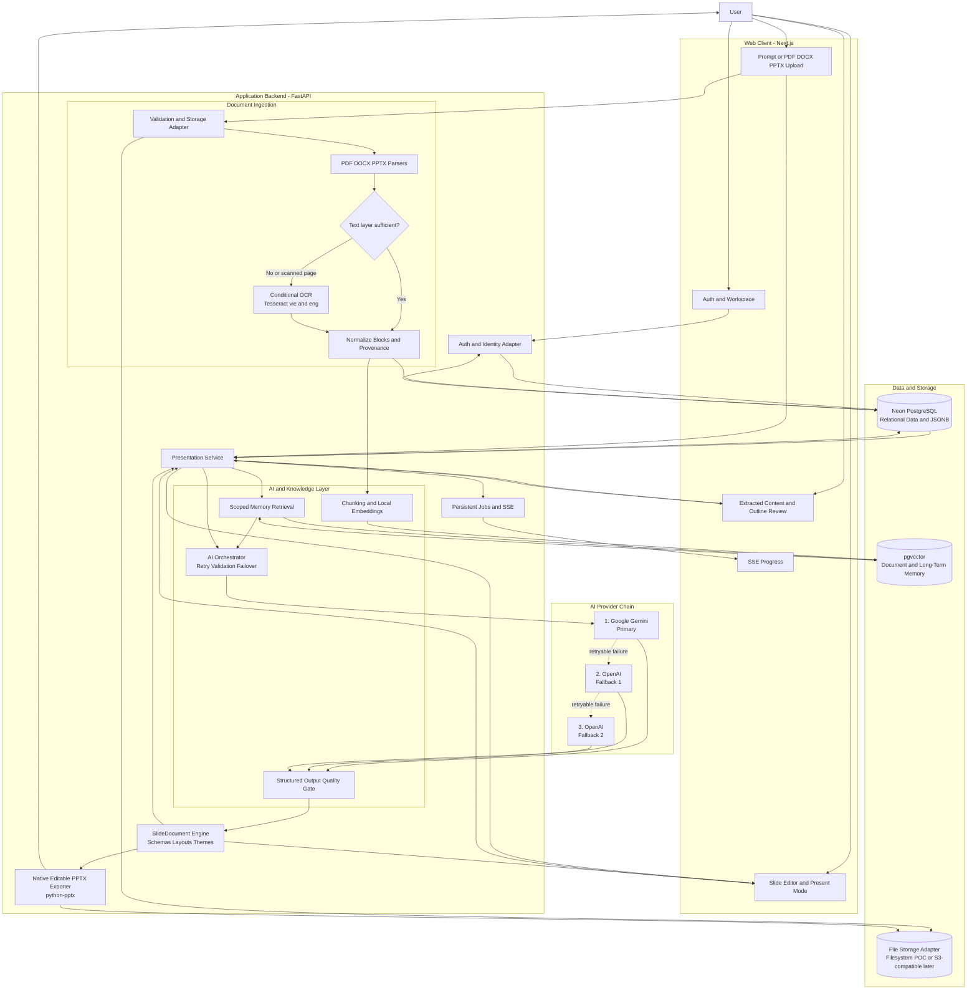
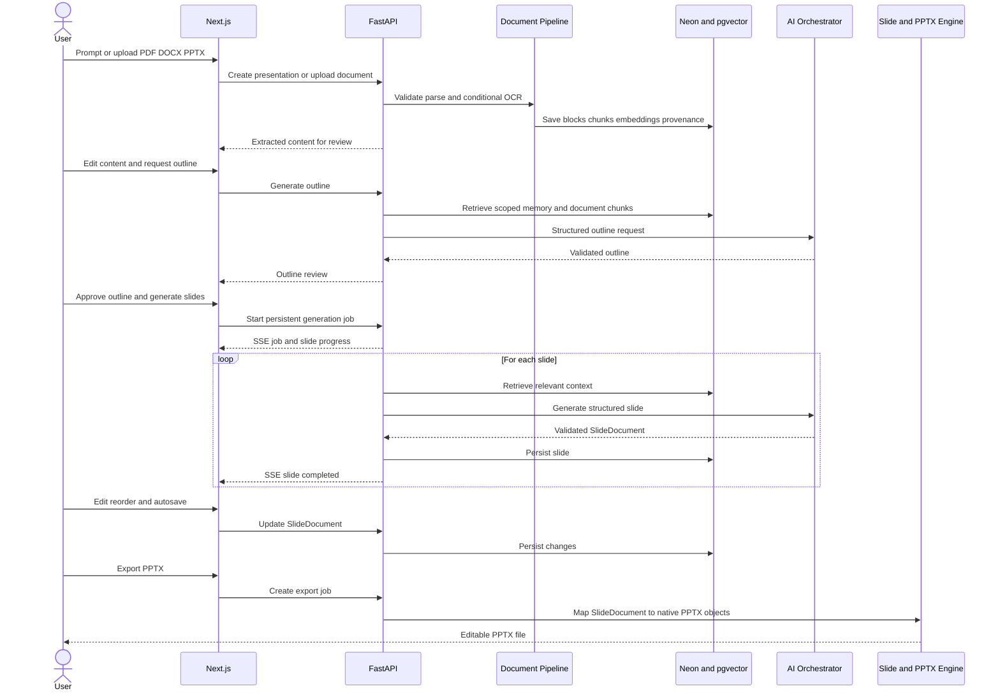

# Gapo SlideGen — High-Level Architecture

Sơ đồ này mô tả các thành phần chính của POC và luồng từ prompt/tài liệu đến web editor, long-term memory và native editable PPTX.

## Luồng xử lý chính

## Ranh giới kiến trúc

- Next.js không chứa AI keys, OCR, database access hoặc business logic.
- FastAPI OpenAPI là nguồn sự thật cho frontend contracts.
- Mọi document, memory, presentation, job và export được scope explicit bằng `owner_id`.
- SSE chỉ truyền tiến trình; database là nguồn sự thật cho job state.
- Web renderer và PPTX exporter dùng chung `SlideDocument`.
- AI chỉ trả structured data; không sinh raw HTML, React hoặc JavaScript để execute.
- OCR chỉ chạy cho trang scan/image-only hoặc text layer không đủ.
- Embeddings mặc định chạy local; Neon pgvector lưu và truy xuất memory.
- PPTX export dùng native text/shapes/images/tables/charts, không flatten toàn slide thành ảnh.

## Preview

- GitHub render trực tiếp các block `mermaid` trong Markdown.
- VS Code built-in Markdown Preview có thể cần extension hỗ trợ Mermaid.
- Có thể copy riêng nội dung trong block vào Mermaid Live Editor để kiểm tra nhanh.
