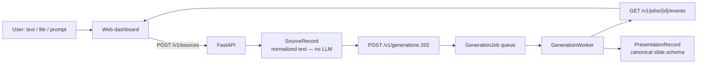
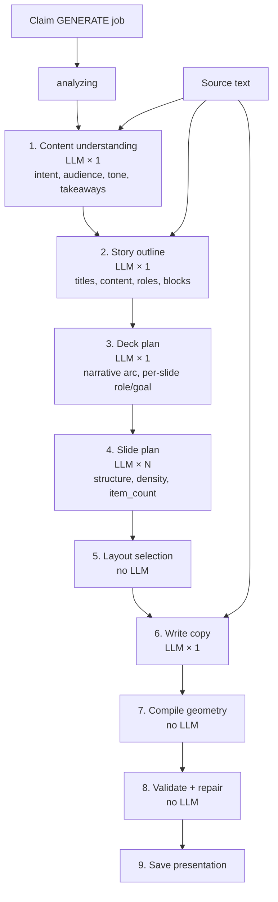
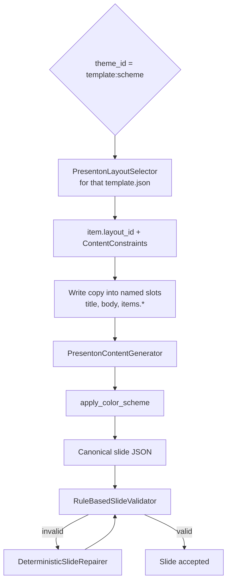
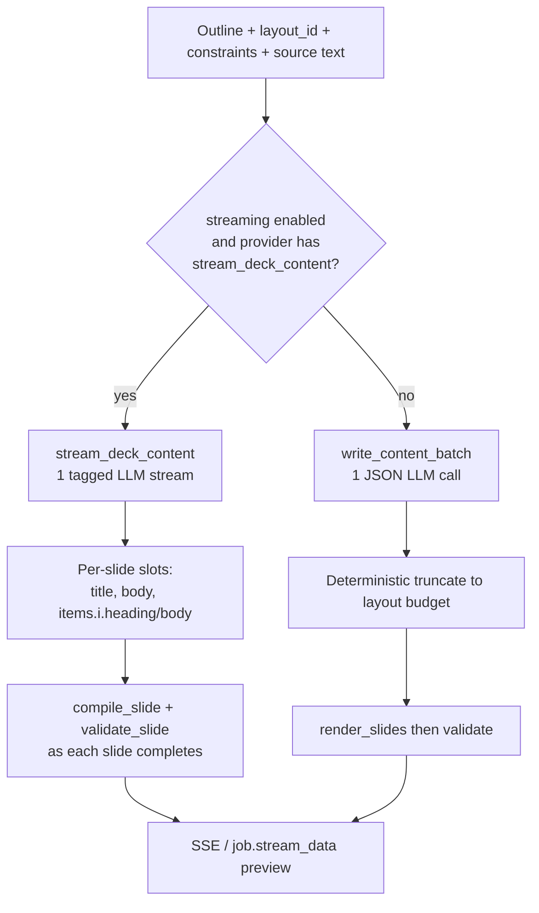
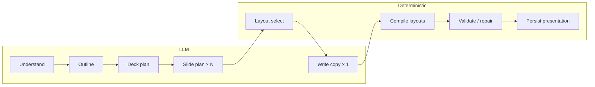

# Generation pipeline architecture

Current worker path from user input to a saved presentation. This file is the
operational source of truth for generation. ADRs in `docs/decisions/` record
why the stages exist; they may lag this document.

Asset planning and image generation are **no-ops** (`NullAssetPlanner` /
`NullAssetGenerator`). Text-to-image API routes are disabled.

Active text providers: `stub` or `company-gateway`. Gemini (`google-ai-studio`)
is a disabled legacy module, not constructed by `factory.py`.

## End to end

The API enqueues. The worker runs the pipeline. The web only streams job
events and opens the editor.

## Worker stages

`N` is the number of outline slides. Happy path with company-gateway and
streaming enabled: **`N + 4` LLM calls**.

If the job already carries a reviewed outline, steps 1–2 are skipped
(`N + 2` LLM calls). Deck/slide plan and copy still run.

## Layout selection and compile

Theme decides both layout ids and the renderer. Constraints used while writing
copy come from the **same** layout that will compile.

New generation always compiles a Presenton layout pack (`modern`, `editorial`,
`executive`, `swift`, `standard`, `momentum`, `general`, `dynamic`) and then
recolors it with one of five schemes. Native layout modules remain in the tree
so older stored decks can still open in the editor. Chart and table layouts
remain excluded from automatic selection.

## Write copy

This is the only stage that produces **on-slide wording**. Outline is
structure; source text is evidence.

Remainder retry: if a compiled slide fails validation, the worker can stream
the **remaining** slides again (max 3 attempts) — extra LLM calls only on
failure.

## LLM vs deterministic

Image generation is disabled (`NullAssetPlanner` / `NullAssetGenerator`).
Export to PPTX is a separate editor/export path, not part of this job.

## Copy length (what the LLM sees)

Gateway calls are **not** native structured output (`response_format`). JSON
stages paste a schema into the prompt, then validate with Pydantic.

To avoid steering the model toward slogans:

- LLM-facing JSON Schema strips `maxLength` / `minLength` (`llm_json_schema`).
- Outline items do **not** ask the model to emit `content_budget`; layout
  constraints win after render.
- Outline prompt: titles stay short (~80); body copy may use ~500 characters
  and block bodies ~350, with a floor of two sentences / one fact-bearing
  sentence on content slides.
- Write-copy prompts (batch JSON and tagged stream) do **not** send per-slot
  character caps. They ask for 2–3 sentences of body copy. Layout bounds are
  applied **after** the model, by sentence-preferring truncate.
- Chat and stream requests set `max_tokens` to 8192. Input source text is
  bounded by `SLIDEGEN_GOOGLE_MAX_INPUT_CHARS` (default 120 000).

Layout safety nets (Presenton / native `ContentConstraints`) still truncate
overflow. Cover body is ~200 characters; list/grid item bodies ~160–180.

## Layout inventory

New generation compiles one of eight Presenton layout packs (modern, editorial,
executive, swift, standard, momentum, general, dynamic) then recolors with a
scheme. Native layout modules remain only so older stored decks can still open.

Compile maps story copy into named slots (`title`, `body`, `card_title`,
`section_heading`, …). Slide-level headings are not treated as cards. Extra
item children beyond the structured blocks are omitted. Large image slots
without an asset are omitted; small icon wells may keep a local SVG.

`apply_color_scheme` then recolors fills and picks text color by contrast
against the surface behind the text, so light template copy does not stay
white on a light scheme.

Stream copy must emit slot names only. If the model repeats a layout id as a
`[[SLOT]]` name, the parser aliases it to the next expected slot.

Rule-based validation after compile checks canvas bounds, overlap, and
minimum font size. There is no screenshot or VLM critic.

Local, gitignored discussion of possible visual work may exist under `futask/`.
That folder is not product direction.
