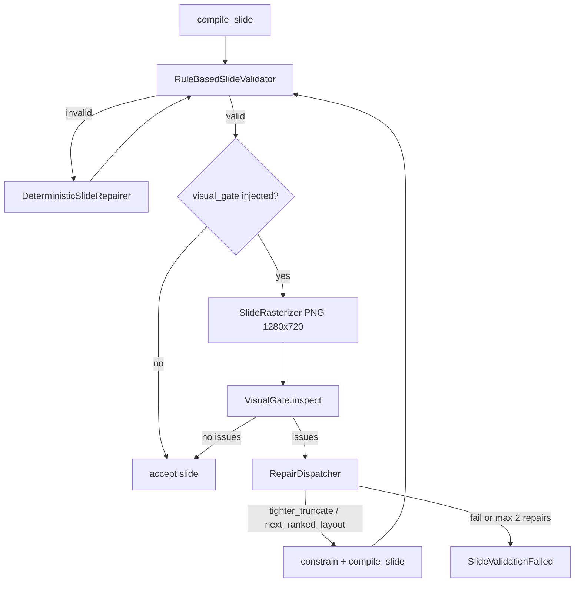

# Visual readability gate

**Status:** approved 2026-08-20
**Date:** 2026-08-20
**Scope:** Generation-time screenshot + OCR readability gate + closed repair loop
**Out of scope:** New layout geometries, deck Art Director, VisualPlan stage, VLM aesthetic scoring, image generation, changes to `RuleBasedSlideValidator` rules, public HTTP APIs

This spec is product direction for this slice. `futask/future-task-1.md` remains local discussion, not an ADR.

---

## 1. Goal

A generation job must not `succeeded` when on-slide copy is missing, truncated by clip, or unreadable in the pixels the editor shows.

Today `RuleBasedSlideValidator` only rejects canvas overflow, element overlap, and font size &lt; 12. Compiled JSON can be “valid” while Konva/`overflow` clips text. This gate looks at a screenshot of that canvas.

Success criteria:

- Screenshot is 1280×720 from the same Konva tree as the editor (`SlideCanvas` read-only).
- OCR/vision classifies **readability only**: `TEXT_MISSING`, `TEXT_TRUNCATED`, `TEXT_UNREADABLE`.
- Repair is a closed catalog: `tighter_truncate` | `next_ranked_layout` | `fail`.
- Default off. Stub jobs and default pytest do not launch Chromium or call vision.
- A later VLM critic is a new `VisualGate` implementation plus new catalog entries, not a new pipeline.

---

## 2. Why this shape

ChatGPT’s loop (`render → screenshot → VLM → free-form repair_instruction`) is the right **destination** for “look at pixels,” the wrong **system** for this repo now:

- Compiler can only pour named slots into a chosen Presenton layout. Prose instructions (“use a funnel”) have no API.
- Layout inventory is cover / list / grid-card / split / metric. Aesthetic critic cannot invent geometry.
- Happy path is already `N + 4` text LLM calls. Do not add planning stages.

The durable frame is three seams. OCR is the first gate implementation. VLM later swaps the gate and grows the catalog when compile targets exist.

---

## 3. Architecture

Keep `route → service → worker → GenerationPipeline`. Do not fold vision into `RuleBasedSlideValidator`. Do not put Playwright inside the validator.

```text
compile_slide
  → RuleBasedSlideValidator + DeterministicSlideRepairer     (unchanged)
  → VisualAcceptanceLoop  (new; skipped if visual_gate is None)
       rasterize → VisualGate.inspect → RepairDispatcher
  → persist / stream preview
```



Happy path with the flag on adds **1 screenshot + 1 vision call per slide**, not extra planning LLMs. Repair adds at most two more compile+screenshot+vision cycles per slide.

### 3.1 Stage boundaries

| Unit | Responsibility | Depends on |
|---|---|---|
| `SlideRasterizer` | Slide JSON → PNG bytes | Konva render package |
| `VisualGate` | PNG + intended copy → structured issues | Gateway vision/OCR |
| `RepairDispatcher` | Issue list → one catalog action | `constrain_slide_content`, `LayoutSelector.rank`, `compile_slide` |
| `GenerationPipeline.accept_slide` | Geometry validate, then visual loop | The three above |

`validate_slide` stays geometry-only so existing tests and the repairer contract do not change. The worker and `validate_document` call `accept_slide` instead of `validate_slide` after compile. Stream path (`IncrementalSlideStreamer.validate_slide`) must be wired to `accept_slide` so a streamed preview is the post-gate slide.

### 3.2 Factory wiring

`build_story_provider()` today always injects `RuleBasedSlideValidator` + `DeterministicSlideRepairer`. Visual stages are **optional constructor args**, default `None` (skip).

When `SLIDEGEN_VISUAL_GATE_ENABLED=true` and the generation provider is `company-gateway` and `SLIDEGEN_VISUAL_GATE_MODEL` is set:

- inject `CliSlideRasterizer`
- inject `CompanyGatewayOcrVisualGate`
- inject `RepairDispatcher` (stateless helper; may live on the pipeline)

Otherwise inject `None` and skip.

- `generation_provider=stub` + flag true: log a warning, leave gate `None` (local/dev pytest stay Chromium-free).
- `company-gateway` + flag true + missing `VISUAL_GATE_MODEL`: raise `ProviderConfigurationError` at worker build.

---

## 4. Seam 1 — Rasterizer

### 4.1 Contract

```python
class SlideRasterizer(Protocol):
    name: str

    def rasterize(self, slide: dict[str, object]) -> bytes:
        """Return a PNG of the slide at editor stage size (1280×720)."""
        ...
```

- Input: one canonical slide dict (`elements`, `background`, theme colors already applied).
- Output: PNG bytes, pixel size **1280×720**, no editor chrome, no transformer, no selection.
- Do not store PNG on `PresentationRecord`. Optional debug dump only (see settings).

### 4.2 Implementation

New workspace package `packages/slide-rasterizer`:

- Tiny React page that mounts `SlideCanvas` from `@gapo-slidegen/slide-editor/canvas` with `readOnly={true}` and `selectedElementId={null}`.
- Stage size `EDITOR_STAGE_WIDTH` × `EDITOR_STAGE_HEIGHT` (1280×720).
- CLI: `node packages/slide-rasterizer/dist/cli.js --slide <path.json> --out <path.png>`
- Playwright Chromium loads the bundled page from a local file URL (or an ephemeral static server if the bundler requires it). Slide JSON is always a temp file passed as `--slide`. Not the Next.js app, not cookies/auth.
- Python `CliSlideRasterizer` runs that CLI with `subprocess`, timeout 30s, cwd repo root. It does **not** add `playwright` to `apps/api` Python deps.

Do not screenshot `SlideThumbnail`. That path is CSS/`overflow: hidden` and is not the editor canvas.

### 4.3 Failure

If the gate is enabled and rasterize throws, times out, or returns empty/non-PNG: raise `SlideValidationFailed` with code `VISUAL_RASTERIZE_FAILED`. Fail closed. Do not `succeeded` without a screenshot.

### 4.4 Tests

- Unit: fake rasterizer returns fixture PNG; pipeline never calls Node.
- Package test: compile a known slide JSON, rasterize, assert PNG signature and 1280×720 (marked optional/integration if Chromium is absent; skip when `SLIDEGEN_VISUAL_GATE_CHROMIUM=0`).

---

## 5. Seam 2 — VisualGate

### 5.1 Contract

```python
VisualIssueCode = Literal[
    "TEXT_MISSING",
    "TEXT_TRUNCATED",
    "TEXT_UNREADABLE",
]

class VisualIssue:
    code: VisualIssueCode
    message: str
    slot: str | None          # "title" | "body" | "items.N.heading" | ...
    element_ids: tuple[str, ...]  # empty in v1; slot matching does not require element ids
    expected: str
    observed: str

class VisualGateResult:
    extracted_text: str
    issues: list[VisualIssue]

    @property
    def readable(self) -> bool:
        return not self.issues

class VisualGate(Protocol):
    name: str

    def inspect(
        self,
        *,
        png: bytes,
        slide: dict[str, object],
        content: SlideContent,
    ) -> VisualGateResult:
        ...
```

`VisualIssueCode` is a closed literal. `inspect` implementations must not return other codes. A future VLM that emits extra codes is parsed with `extra="ignore"` / skipped when the code is not in the literal. The dispatcher never executes free-form text.

### 5.2 Intended copy

`SlideContent` is the source of truth for what should appear:

- `title`
- `slots["body"]` if a non-empty string
- each `slots["items"][i]` `heading` / `body` / `label` / `value` that is a non-empty string

Empty slots are not expected on the image. Do not compare outline `item.content` after write-copy; the writer may have changed wording.

### 5.3 OCR provider

New class `CompanyGatewayOcrVisualGate` (not methods piled onto `CompanyGatewayProvider`).

- Same `SLIDEGEN_COMPANY_GATEWAY_URL`, API key, and `SLIDEGEN_COMPANY_GATEWAY_CHAT_PATH`.
- Model: `SLIDEGEN_VISUAL_GATE_MODEL` (required when the flag is on).
- OpenAI-compatible `messages[].content` parts: text prompt + `image_url` with `data:image/png;base64,...`.
- `max_tokens`: 2048. Temperature 0.
- Retry once on 429/5xx, same policy as text chat. Then fail the job with `VISUAL_GATE_UNAVAILABLE`.

The model returns JSON (prompt-pasted schema, validated with Pydantic — same pattern as other gateway JSON stages):

```json
{
  "extracted_text": "all visible text in reading order",
  "unreadable": false,
  "notes": ""
}
```

Python owns classification. The model must not emit repair instructions or layout ids.

### 5.4 Classification (deterministic)

Normalize both expected and `extracted_text` with: Unicode NFC, collapse whitespace, keep Vietnamese letters/diacritics, strip only leading/trailing space. Do not case-fold Vietnamese in a locale-unspecified way — compare case-insensitively with `casefold()`.

Coverage of expected string `E` in extracted text `T`:

- 1.0 if `E` is a substring of `T`
- else `len(lcs(E, T)) / len(E)` when `len(E) > 0`

Thresholds:

| Code | When |
|---|---|
| `TEXT_UNREADABLE` | Model `unreadable=true`, **or** concatenated expected length ≥ 20 and overall coverage of the concatenation &lt; 0.30 |
| `TEXT_MISSING` | Slot coverage &lt; 0.50 (title uses this first; a missing title is always an issue) |
| `TEXT_TRUNCATED` | Slot coverage in `[0.50, 0.85)` **or** `T` contains a prefix of `E` of length ≥ 50% of `E` but coverage &lt; 0.95, and `len(E) ≥ 24` |

One slot emits **one** code (unreadable wins over missing wins over truncated). Decorative shapes are ignored. Do not require OCR to match icon labels or theme chrome.

If `extracted_text` is empty and expected copy is non-empty: `TEXT_UNREADABLE` on `title` (or `body` if no title).

### 5.5 Tests

Fixture extracted strings vs fixture `SlideContent` — no HTTP. Separate test that unknown codes in a stub gate result are ignored by the dispatcher.

---

## 6. Seam 3 — RepairDispatcher

### 6.1 Catalog (v1, closed)

```python
RepairAction = Literal["tighter_truncate", "next_ranked_layout", "fail"]
```

Maximum **2** repair actions per slide (`VISUAL_GATE_MAX_REPAIRS = 2`). Each action is followed by geometry validate + rasterize + inspect. A third failure is `fail`.

One action per loop. Priority if several issues exist:

1. any `TEXT_UNREADABLE` → `next_ranked_layout`
2. `TEXT_MISSING` on `title` → `next_ranked_layout`
3. `TEXT_MISSING` or `TEXT_TRUNCATED` on body/items → `tighter_truncate`
4. nothing applicable → `fail`

Do not call the copy-writer LLM inside this loop.

### 6.2 `tighter_truncate`

Build new `ContentConstraints` at **70%** of the current layout’s limits (integer, minimums: title 24, body 48, block heading 16, block body 32, `max_items` at least 1).

If any issue slot starts with `items` and `max_items > 1`, also drop the last item (`max_items -= 1`).

Apply `constrain_slide_content(content, constraints)` from `content_schema.py`. Recompile the **same** `layout_id`.

### 6.3 `next_ranked_layout`

`LayoutSelector` gains `rank(...)` with the same signature as `PresentonLayoutSelector.rank`. `ThemeDispatchLayoutSelector.rank` forwards to `_delegate(theme_id).rank(...)`. `NativeLayoutSelector.rank` returns a one-element list for `select(...)` so the protocol stays implementable; new generation does not use native layouts.

Walk the ranking in score order. Skip:

- the current `layout_id`
- layouts already tried in this slide’s loop
- `is_auto_excluded_layout` unless it was an explicit `item.layout_id`

Pick the first remaining candidate. Write `item.layout_id` and `content.layout_id` to that id (mutation of the in-memory outline item is required so `PresentonContentGenerator._build_slide` does not re-select). Constrain copy to the **new** layout’s `content_constraints`. Recompile. No new LLM copy.

If the ranking is exhausted: `fail`.

This uses layouts that already compile. It does not add funnel/timeline/dashboard.

### 6.4 `fail`

Raise `SlideValidationFailed` with the visual issue codes, e.g. `Slide 'point-1' failed visual validation: TEXT_TRUNCATED`. Job status `failed`, worker `error_code` stays `generation_failed` (existing). The visual code lives in `error_message`. Same exception type as geometry failure so the worker path does not fork.

### 6.5 Tests

- Truncated body → constraints shrink → `compile_slide` called again with same layout.
- Unreadable → `rank()` second layout used; `item.layout_id` updated.
- Two failed repairs → `SlideValidationFailed`.
- `rank()` with a single layout + `TEXT_UNREADABLE` → `next_ranked_layout` finds nothing → `fail` immediately (do not truncate; truncate cannot fix contrast/clip of the whole slide).

---

## 7. Pipeline insertion

### 7.1 `GenerationPipeline.accept_slide`

New method. Inputs must include enough context to recompile:

- `slide`
- `request`, `outline`, `index`, `assets`, `contents` (the writable `dict[str, SlideContent]`)
- `plan: SlidePlan | None`

Algorithm:

1. `slide = validate_slide(slide)` (geometry + existing repairer).
2. If `self.visual_gate is None` or `self.slide_rasterizer is None`: return `slide`.
3. If there is no `SlideContent` for this slide id: return `slide` (cannot know intended copy).
4. Loop `attempt = 0 .. MAX_REPAIRS` inclusive (default 2 repairs ⇒ 3 inspects):
   - PNG = rasterize(slide)
   - result = inspect(png, slide, contents[item.id])
   - if readable: return slide
   - if `attempt == MAX_REPAIRS`: fail
   - action = dispatcher.choose(result.issues)
   - if action is `fail`: raise
   - apply action (mutates outline item / contents)
   - `slide = content_generator.render_slide(...)`
   - `slide = validate_slide(slide)`
5. Unreachable; fail.

`validate_document` uses `accept_slide` for each slide. Worker `_render_slide_by_slide` and stream `compile_slide`/`validate_slide` hook use `accept_slide`.

### 7.2 Call counts

With flag on, no repairs: **`N + 4` text LLM + `N` vision**. Each repair adds one screenshot and one vision call. Worst case per slide: 3 vision calls (initial + 2 repairs). Worst case deck: `N + 4` text + `3N` vision. Document this in `docs/generation-pipeline-architecture.md` at implementation time.

### 7.3 Streaming

Remainder retry (copy stream incomplete) is unchanged and happens **before** visual acceptance. Visual repairs do not re-stream copy.

---

## 8. Settings

All prefixed `SLIDEGEN_` in `apps/api/app/config.py` and `.env.example`:

| Setting | Default | Meaning |
|---|---|---|
| `VISUAL_GATE_ENABLED` | `false` | Master switch |
| `VISUAL_GATE_MODEL` | unset | Gateway vision/OCR model id |
| `VISUAL_GATE_MAX_REPAIRS` | `2` | Per-slide repair cap |
| `VISUAL_GATE_RASTERIZER_CMD` | `node packages/slide-rasterizer/dist/cli.js` | CLI invoked by Python |
| `VISUAL_GATE_SAVE_SCREENSHOTS` | `false` | If true, write PNG under `{storage_root}/visual-gate/{job_id}/{slide_id}.png` (`.data/` already gitignored) |

See §3.2 for enable rules. Pytest may set `SLIDEGEN_VISUAL_GATE_CHROMIUM=0` to skip the optional rasterizer package test; that variable is test-only and is not a Settings field.

---

## 9. What VLM scale looks like (not this slice)

Do not implement these now. They exist so v1 types do not block v2:

1. Keep `SlideRasterizer` and PNG size.
2. Add `VlmVisualGate` implementing the same `inspect` contract. It may emit additional codes (`HIERARCHY_WEAK`, `BALANCE_OFF`, …) **only after** those codes are added to `VisualIssueCode` and mapped in the dispatcher.
3. Grow `RepairAction` when a compile target exists (e.g. `switch_layout("timeline")` after a timeline layout ships). Until then the gate must drop or map those codes to `fail`, never to prose.
4. Do not add Art Director / VisualPlan stages as part of “turning on VLM.”
5. Do not accept `repair_instruction: str` as an executable field.

v1 already drops unknown codes, so an experimental VLM that emits extra codes cannot silently mutate slides.

---

## 10. Error semantics

| Situation | Job |
|---|---|
| Geometry invalid after repairer | `failed` / `SlideValidationFailed` (existing) |
| Gate off | no visual effect |
| Rasterize fail, gate on | `failed` / `VISUAL_RASTERIZE_FAILED` |
| Vision HTTP fail after retry | `failed` / `VISUAL_GATE_UNAVAILABLE` |
| Unreadable/truncated after 2 repairs | `failed` / visual issue codes |
| Gateway JSON parse fail | treat as `VISUAL_GATE_UNAVAILABLE` (fail closed) |

Do not persist a presentation on visual failure.

---

## 11. Files

**Create**

- `packages/slide-rasterizer/` — Konva Playwright CLI
- `apps/api/app/generation/stages/slide_rasterizer.py` — protocol + `CliSlideRasterizer`
- `apps/api/app/generation/stages/visual_gate.py` — protocol, OCR gate, coverage helpers
- `apps/api/app/generation/stages/repair_dispatcher.py`
- `apps/api/tests/test_visual_gate.py`
- `apps/api/tests/test_repair_dispatcher.py`
- `apps/api/tests/test_accept_slide.py`

**Modify**

- `apps/api/app/generation/stages/protocols.py` — `LayoutSelector.rank`
- `apps/api/app/generation/stages/layout_selector.py` — `ThemeDispatchLayoutSelector.rank`
- `apps/api/app/generation/stages/orchestrator.py` — `accept_slide`, optional rasterizer/gate
- `apps/api/app/generation/factory.py` — flag wiring
- `apps/api/app/generation/worker.py` — `accept_slide`
- `apps/api/app/generation/stream_runtime.py` — validate hook
- `apps/api/app/config.py`, `.env.example`
- `apps/api/app/generation/stages/__init__.py`
- `docs/generation-pipeline-architecture.md` — stages 8–9, call counts
- `docs/decisions/m1-generation-pipeline-stages.md` — replace the open “VLM critic” note with a pointer to this spec

**Do not modify**

- `RuleBasedSlideValidator` issue codes
- Presenton template JSON / new archetypes
- `NullAssetPlanner` / image routes
- Public REST contracts

---

## 12. Testing policy

Default `pytest` (`npm run api:test`) stays Chromium-free and vision-free. Fakes for rasterizer and gate.

Coverage that must exist before calling the slice done:

- Coverage thresholds → issue codes
- Dispatcher: truncate, next layout, fail, drop unknown codes
- `accept_slide` skip when gate is `None`
- `accept_slide` loop + `SlideValidationFailed`
- Factory: flag off → `None`; stub + flag on → `None`; company-gateway + flag + model → real classes
- Worker still succeeds on stub without Node rasterizer

Optional: one Playwright rasterize test behind Chromium presence.

---

## 13. Implementation notes (non-goals disguised as tips)

- `PresentonContentGenerator._build_slide` honors `item.layout_id` when set. Dispatcher must set it before recompile.
- Reuse `constrain_slide_content`; do not add a third truncate helper.
- Rasterizer package depends on existing Konva 10.3.0 / react-konva 19.2.5 pins (dependency policy).
- Windows worker: CLI must be a `node` invocation, not a Unix-only shell script.
)
